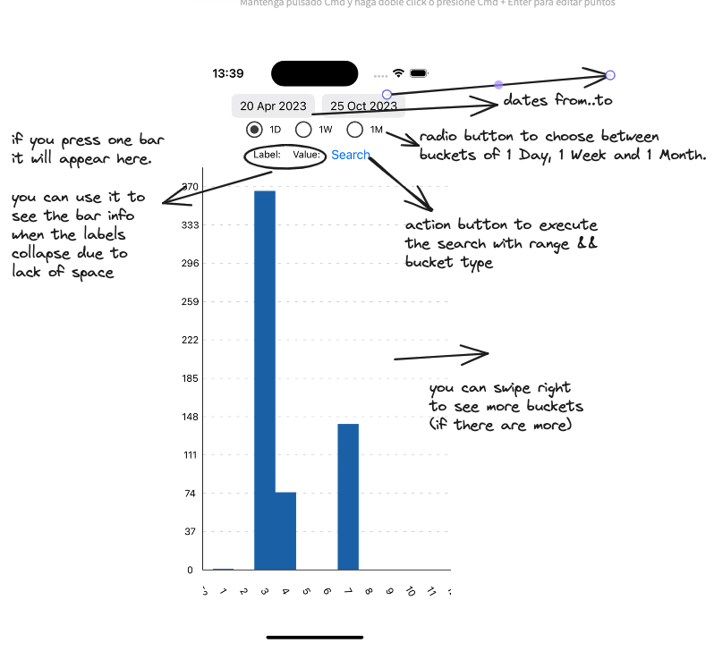

# chart

TECH:

This project is made with expo to focus on resolution.
When download, execute npm install and then npx expo start.

PRODUCT:
Product req: "per month for the past 1 year"
Histogram:
f(x) = y
where x = bucket = moment of time = minimum interval
f(x): total pr updated that in that moment of time

Because the api limits and truncates the result and since I only need the total_count in each request.
I will do N requests. One request = one bucket (one minimum division of the date range)
In the base case they will be 13 requests. Division: month. Range (from-to): 1 Year. 13 months in 1 year including the same month in both years.

I am including the first and last day in the first and last buckets. For example, if we pick 5 of May, 2023 to 6 June, 2023, the first bucket
starts in 1 May - 2023, and the last finishes in 30 Junes.

Types of buckets: 1D, 1W, 1M,
Other examples:
Type of bucket: 1D, Range: 2023-05-06 - 2023-05-08. Number of buckets (requests): 3.
Type of bucket: 1W: Range: 2023-05-06 - 2023-06-08. Buckets: 2. (Both days are in different weaks)
Type of bucket: 1W: Range: 2023-05-06 - 2023-06-08. Buckets: 6.

IMPORTANT NOTE: you need a OAuth App Token to avoid rate limiting. If you do not use any kind of token you have 10 requests. With PAT, you have 30 requests.

src/utils/constants.ts here you can add your Token to avoid low rate limit -> GITHUB_TOKEN

Guide: https://docs.github.com/en/enterprise-server@3.6/authentication/keeping-your-account-and-data-secure/managing-your-personal-access-tokens

UI/UX:

**NOTES: I ran out of time due to the deadline (25 oct), it is posible to see when I started, etc (obvious) in the commit history. I would really like to do more testing including some datepicker testing with RNTL or maybe an e2e with detox (I had to fix the Android datepicker as fast as I could so I see it 'fragile'). I would appreciate to talk about this in a posible meeting.**

**Preferred to be tested on iPhone**

Thank u for ur time
